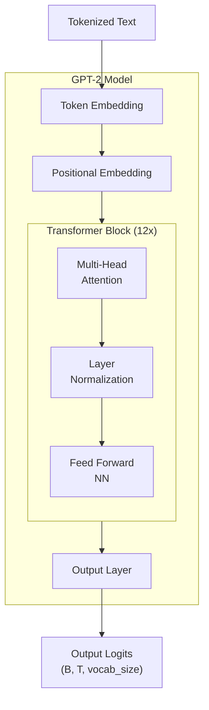

### Talk: Machine learning with Pytorch

#### Specifically: The transformer in GPT
Autoregression model, in particular next token prediction

#### What is covered
+ I will touch the architecture of the transformer, side by side the source code.

Transformer architecture

+ At the end, I will train a super small GPT model:
  + training data (10k short sentences, ex: child reads a book)
  + "vocab_size": 103, "block_size": 8 (context window), "n_embd": 3, "n_head": 3, "n_layer": 2

