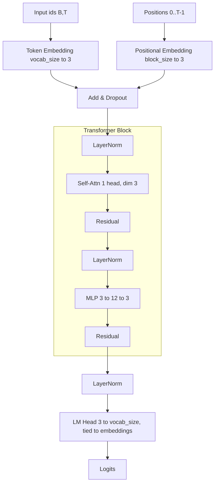

# Minimal GPT-2 (toy) workflow
### Pre-requisite
+ python
+ vscode

### Installation

- [ ] python -m venv venv
- [ ] source venv/bin/activate
- [ ] pip install -r requirements.txt

This folder hosts the stripped-down GPT-2 model and a tiny toy dataset built from 10 short, potentially ambiguous sentences.

## What was added
- `model.py`: minimal GPT-2 (`n_layer=2`, `n_head=3`, `n_embd=3`, `block_size=8`, weight tying).
- `data/sentences.txt`: 10 sentences (with ambiguous words like crane/bank/seal/batter/light).
- `data/prepare.py`: builds vocab, appends `<eos>`, pads each sentence to the max length (5) with `<eos>`, and writes `train.pt`, `val.pt`, `meta.json`.
- `train.py`: tiny training loop on the prepared tensors, saves `data/gpt2_minimal.pt`.

## Commands
From repo root:
- Prepare data (build vocab/train/val):
  - `python data/prepare.py --generate 10000 --train-frac 0.9`
```
Prepared dataset
Vocab size: 28
Train samples: 8, Val samples: 2
Sequence length: 5, Block size: 8
```
- Train the tiny model:
  - `python train.py`
```
epoch 020 | train_loss 3.0568 | val_loss 3.4200
epoch 040 | train_loss 2.6083 | val_loss 2.8512
epoch 060 | train_loss 2.3631 | val_loss 2.6916
epoch 080 | train_loss 2.2187 | val_loss 2.2150
epoch 100 | train_loss 1.8108 | val_loss 2.1704
epoch 120 | train_loss 1.4860 | val_loss 2.1670
epoch 140 | train_loss 1.4013 | val_loss 1.9624
epoch 160 | train_loss 1.4911 | val_loss 1.7179
epoch 180 | train_loss 1.4626 | val_loss 1.6629
epoch 200 | train_loss 1.0616 | val_loss 1.6558
Saved checkpoint to /Users/vutr/05.python/00.learn/zachary/gpt-2/data/gpt2_minimal.pt
```
- generate:
  - `python generate.py --prompt "child" --max-new 5 --temperature 0.7 --top-k 5`
```
Prompt tokens: ['child']
Prompt ids: tensor([[24]])
Generated token ids: tensor([[24, 98, 94, 93, 82,  0]])
Raw decoded tokens: ['child', 'walks', 'to', 'the', 'school', '<eos>']
Raw decoded text: child walks to the school <eos>
Truncated at <eos> tokens: ['child', 'walks', 'to', 'the', 'school']
Truncated text: child walks to the school
```

## Current toy config (train.py)
- vocab_size: from `meta.json` (computed, here 28)
- block_size: from `meta.json` (8)
- n_layer: 1
- n_head: 1
- n_embd: 3
- dropout: 0.0

Artifacts:
- `data/meta.json`: vocab (size 28), mappings, block_size (8), eos token.
- `data/train.pt`, `data/val.pt`: tensors `input_ids`, `target_ids`.
- `data/gpt2_minimal.pt`: checkpoint saved after training.
```
It’s a PyTorch checkpoint saved via torch.save, so it’s a binary, pickle-based .pt file. Inside, we stored a dict with:
+ model_state: the state_dict() tensor weights.
+ config: the GPTConfig fields used at save time.
+ meta: dataset metadata (vocab, stoi/itos, block_size, etc.).
```

## Mermaid architecture

The following chart reflects the current config (n_layer=1, n_head=1, n_embd=3, block_size=8, vocab_size from meta).



## Notes on sequence handling
- Each sentence gets an `<eos>` at the end; padding also uses `<eos>`. This prevents sentences from merging (e.g., `crane ate fish` will not be joined with `crane lifted steel`).
- Max observed length is 5; `block_size` is 8, so all sequences fit without truncation.

## Do we need a start-of-sentence (`<s>`/`<bos>`) token?
- Not required for this toy setup. The model trains to predict the next token within each padded sentence and learns to emit `<eos>` at the end. If you later want explicit “begin” conditioning or longer multi-sentence streams, you could add a BOS token and include it in the vocab and inputs; the current pipeline omits it on purpose for simplicity.