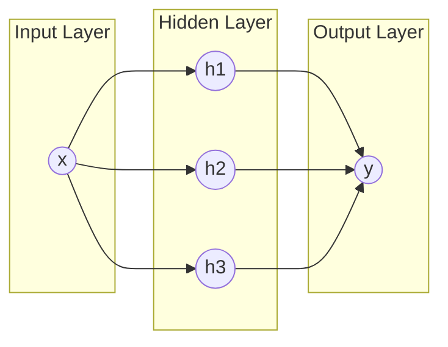

### Autoregression

### Regress

### Tensor

### requires_grad=True

```mermaid
graph LR
    subgraph "Input Layer"
        direction TB
        A1((x))
    end

    subgraph "Hidden Layer"
        direction TB
        H1((h1))
        H2((h2))
        H3((h3))
    end

    subgraph "Output Layer"
        direction TB
        O1((y))
    end

    A1 --> H1
    A1 --> H2
    A1 --> H3

    H1 --> O1
    H2 --> O1
    H3 --> O1
```
